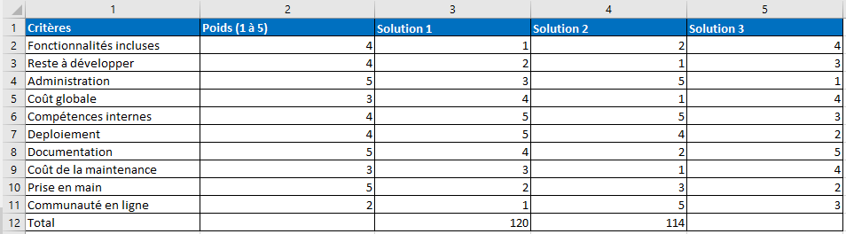

# Exercice 1 : analyse des besoins

A partir des besoins exprimés ci-après, en équipe : 

1. **Étudiez l'offre en analysant les besoins.** 
- Faites des recherches sur le **métier photographe** et/ou du **domaine** si nécessaire.
- Étudiez et identifiez les **contraintes** de l'existant (site web et blog du client, [lien pour identifier le CMS utilisé et d'autres infos](https://whatcms.org)).
- Faites une **analyse CQQCOQP** (Combien, Quand, Qui, Comment, Où, Quoi et Pourquoi).

2. Réfléchissez aux **solutions envisageables** pour répondre aux besoins du client.
- Réalisez un **tableau comparatif (matrice de décision)** de vos solutions en définissant vos critères de sélection en rapport aux besoins du client ;
- Pondérez les critères de 1 à 5
- Attribuez un score de 1 à 5 à chaque critère et solution ;
- Effectuez la somme des scores obtenus pour chacune des solutions proposées. (Somme = score critère 1 * poids du critère + (...) + score critère N *  poids critère N)

#### Illustration matrice de décision

## Offre

Je suis un photographe indépendant et j'ai besoin d'un crm adapté à mes besoins.
- gestion des clients (nom, courriel, adresse postale, téléphone, sexe, date de naissance, réseaux sociaux, etc.)
- système de signature de contrats
- gestion des dossiers /projets (séances)
- gestion des événements (vue des séances sur calendrier)

[Lien de l'appel d'offre](https://www.codeur.com/projects/330179-creation-d-un-crm)

PS : ne vous fiez pas au budget indicatif indiqué sur le site, il s'agit du prix par défaut lorsque le client n'a pas spécifié cette info.

[Site web du client](https://justinehphotography.com/)
